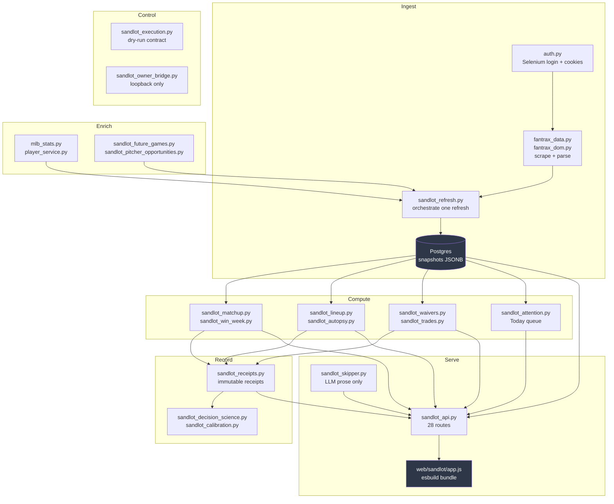

# Orientation

**Entry point for this repository.** Start here, then follow the pointers.

**Describes:** `origin/main` @ `bd54135` (2026-07-14) · **Written:** 2026-07-24

> This file is a **map and a trust guide**. It does not restate
> `docs/ARCHITECTURE.md`, which remains the authority on stack and data flow —
> subject to the correction in [D1](doc-drift.md#d1). Where this file and any
> other disagree on a fact, this one was verified against code on the date above;
> that is the only reason to prefer it.

---

## First, check you are on the right tree

The primary working checkout has historically drifted far behind `origin/main`.
Before trusting anything you read locally:

```bash
git fetch origin && git log --oneline HEAD..origin/main | wc -l
```

Non-zero means your checkout is behind. If `sandlot_matchup.py` does not exist
in your tree, you are looking at a version of this project from before roughly
May 2026 and essentially every document here will mislead you.
See [R22](risk-register.md#r22).

---

## What this is

A **single-user** fantasy baseball decision tool. It scrapes Fantrax daily,
stores snapshots as Postgres JSONB, computes deterministic recommendations —
lineup, waivers, trades — and presents them in a mobile web app. An LLM
("Skipper") explains those recommendations in prose.

Three properties define the design, and each is load-bearing:

1. **No LLM touches a number.** Every displayed figure is deterministic. The model only writes sentences about figures that already exist.
2. **Writes are fail-closed, structurally.** No Fantrax mutation path exists in the codebase — not a disabled one, an absent one. Recommendations are advisory; the human executes.
3. **Decisions leave immutable receipts.** Decision-time evidence is preserved beyond snapshot retention so a recommendation can be evaluated after the outcome is known.

Property 3 is the foundation of the learning roadmap, and it is currently not
functioning — see [assessment.md §3](assessment.md).

---

## The map



### Modules by role

| Role | Modules |
|---|---|
| **Scrape** | `auth.py`, `fantrax_data.py`, `fantrax_dom.py` |
| **Refresh** | `sandlot_refresh.py`, `sandlot_cron.py`, `sandlot_config.py` |
| **Persistence** | `sandlot_db.py` — all Postgres access, no SQL elsewhere |
| **Player context** | `player_service.py`, `mlb_stats.py` |
| **Projection** | `sandlot_matchup.py`, `sandlot_win_week.py`, `sandlot_lineup.py`, `sandlot_pitcher_opportunities.py`, `sandlot_future_games.py` |
| **Transactions** | `sandlot_waivers.py`, `sandlot_trades.py`, `sandlot_trade_outcomes.py`, `sandlot_trade_evidence.py` |
| **Today queue** | `sandlot_attention.py` |
| **Learning** | `sandlot_receipts.py`, `sandlot_decision_science.py`, `sandlot_calibration.py`, `sandlot_autopsy.py` |
| **Execution control plane** | `sandlot_execution.py`, `sandlot_owner_bridge.py` |
| **Data gates** | `sandlot_data_quality.py` |
| **LLM** | `sandlot_skipper.py` |
| **HTTP** | `sandlot_api.py` |
| **Frontend** | `web/sandlot/` — `main.jsx` → `v2-pages.jsx` + `atoms.jsx`, bundled by esbuild to `app.js` |
| **Operational scripts** | `scripts/run_monday_lineup.py`, `run_autopsy.py`, `run_skipper_evals.py`, `sandlot_readonly_monitor.py`, `sandlot_execution_runner.py` |
| **Legacy — dormant** | `audit.py`, `league_intel.py`, `decision_engine.py`, `research_layer.py`, `claude_analyzer.py`, `pybaseball_layer.py`, `notify.py` |

The legacy CLI is not part of the live product. `auth.py` and `fantrax_data.py`
are shared with it; nothing else is.

### Frontend build — note carefully

`web/sandlot/index.html` loads **one** file: `app.js`, an esbuild bundle
committed to the repository. There is no build step in the `Procfile`, so the
committed bytes are what production serves.

```bash
npm run build:sandlot   # after ANY edit to a .jsx file
```

Skipping this ships stale code while source review looks correct.
See [R17](risk-register.md#r17).

---

## Which documents to trust

Audited 2026-07-24. Details in [doc-drift.md](doc-drift.md).

| Document | Trust | Note |
|---|---|---|
| `PRODUCT.md`, `DESIGN.md` | ✅ Reliable | |
| `docs/sandlot-execution-dry-run.md` | ✅ Verified exact | Constants match code |
| `docs/sandlot-automation.md` | ✅ Verified | |
| `docs/sandlot-matchup-projection-model.md` | ✅ Verified | Describes the model accurately — see [assessment.md §2](assessment.md) for whether the model is *good* |
| `docs/win-this-week.md` | ✅ Verified | |
| `AGENTS.md`, `CLAUDE.md` | ⚠️ Accurate but incomplete | Missing the three execution kill-switches ([D4](doc-drift.md#d4)) |
| `docs/recommendation-receipts.md` | ⚠️ Safety claims hold | Two stale version strings |
| `docs/ARCHITECTURE.md` | ❌ **Frontend section is false** | Was wrong when written ([D1](doc-drift.md#d1)) |
| `STATUS.md` | ❌ Not current state | Asserts a nonexistent endpoint ([D3](doc-drift.md#d3)) |
| `docs/SANDLOT-HANDOFF.md` | ❌ **Contains a destructive instruction** | Do not act on it ([D2](doc-drift.md#d2)) |
| `README.md` | ❌ Documents the dormant CLI | Right conclusion, obsolete reasoning ([D6](doc-drift.md#d6)) |
| `docs/quality/*` | ⚠️ Unlabeled history | Binding vs. completed is indistinguishable |

---

## Where to start

**Understanding the system** → `PRODUCT.md`, then `docs/ARCHITECTURE.md`
(skipping its frontend section), then trace one refresh through
`sandlot_refresh.py` → `sandlot_db.py` → `sandlot_api._snapshot_payload()`.

**Fixing a bug** → [risk-register.md](risk-register.md). Twenty-two verified
findings with briefs, ordered.

**Improving recommendation quality, or adding ML** → [assessment.md](assessment.md).
Read §3 first; most of the roadmap is blocked behind one join condition, and the
honest recommendation on ML is "not yet, and mostly not at all."

**Working as an AI agent in this repo** → `AGENTS.md` and `CLAUDE.md`, then
[doc-drift.md](doc-drift.md) before acting on anything either file says about
the frontend or about `/api/actions`.

**Operating it** → `docs/sandlot-railway-v1.md`, `docs/sandlot-automation.md`.

---

## Facts worth knowing early

- **`/api/health` is the only no-DB-friendly probe.** Everything else 503s without `DATABASE_URL`, which is the normal local state.
- **28 routes**, most intentionally unauthenticated — single-user by design. Several cost money per request; see [R1–R3, R8, R12](risk-register.md).
- **Snapshot retention is ~15 days** (30 snapshots at 2 refreshes/day).
- **588 Python tests plus 47 Playwright tests.** Quality is genuinely good, but nine data-conditional skips mean the E2E suite goes green when production breaks — [R7](risk-register.md#r7).
- **The cached-AI pattern** (`ai_briefs`, keyed by `(snapshot_id, brief_type, subject_key)` with `input_hash`) is the reference approach for new AI features. `sandlot_waivers.py` and `sandlot_trades.py` are the examples.
- **Silent-empty is this system's dominant failure mode.** Failures repeatedly present as ordinary empty states — a join that discards rows, a gate that can never open, tests that skip instead of fail, a normalizer that reports "fresh" for missing data. When something reads as *no data yet*, verify it is not actually *data being dropped*.

---

## Provenance

Produced by a four-agent parallel audit of `bd54135`, with every finding
re-verified against source before inclusion. Findings that were not
independently re-checked are marked 🔶 in the companion documents.

Companions: [risk-register.md](risk-register.md) ·
[assessment.md](assessment.md) · [doc-drift.md](doc-drift.md)
