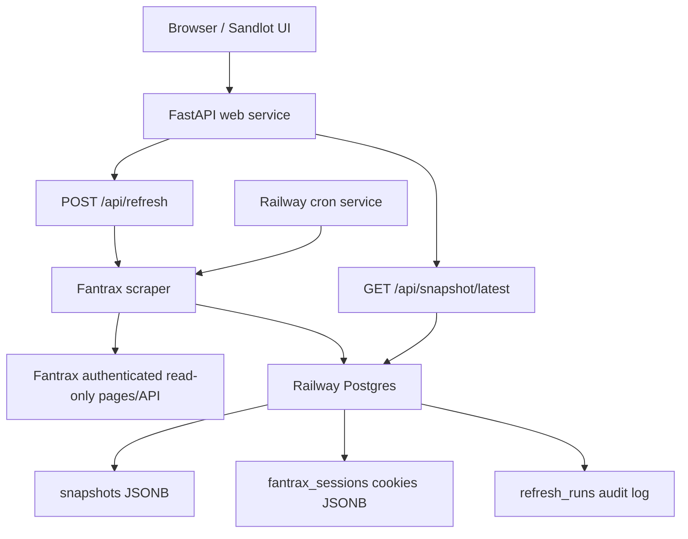

# Sandlot V1 Execution Handoff

## Summary

Sandlot V1 should ship as a real-data viewer first: fresh Fantrax scrape,
snapshot stored in Postgres, frontend displays real roster and standings,
manual refresh works, daily cron works.

Do not build trade ML, add/drop execution, lineup execution, or Skipper chat
yet. `OPENROUTER_API_KEY` can stay in local/Railway secrets for later, but it
is not required for this milestone.

## Current State

- GitHub repo: `https://github.com/zoelsner/baseball`
- Latest pushed commit: `861cb4a3704dd6a90626c20c2d4833bfb3f3320a`
- Git attribution is correct: `Zach Oelsner <29473004+zoelsner@users.noreply.github.com>`
- `.env.example` contains placeholders only.
- Real secrets live in `.env`, which should remain ignored by git.
- FastAPI, Postgres helpers, refresh runner, cron entrypoint, and frontend API loading are already implemented.

## Technical Architecture

V1 services:

- **Web service**: `uvicorn sandlot_api:app --host 0.0.0.0 --port ${PORT:-8000}`
- **Cron service**: `python sandlot_cron.py`
- **Database**: Railway Postgres
- **Frontend**: static Sandlot React prototype served by FastAPI from `web/sandlot`

Data model:

- `snapshots`: raw Fantrax snapshot JSONB, scrape status, error, duration, timestamp, team/league metadata.
- `fantrax_sessions`: stored Fantrax cookies for Railway scraping.
- `refresh_runs`: manual/cron refresh audit log.

Primary API contract:

- `GET /api/health`: app/database/freshness status.
- `GET /api/snapshot/latest`: latest successful roster + standings payload.
- `POST /api/refresh`: runs fresh scrape, stores result, returns latest snapshot. Requires `SANDLOT_REFRESH_TOKEN` when set.

## Execution Steps

1. **Provision Railway**
   - Create one Railway project from the GitHub repo.
   - Add Railway Postgres.
   - Create web service using the repo `Procfile`.
   - Create cron service using `python sandlot_cron.py`.

2. **Set Railway Variables**
   - `DATABASE_URL`
   - `FANTRAX_LEAGUE_ID`
   - `FANTRAX_TEAM_ID`
   - `SANDLOT_REFRESH_TOKEN`
   - `SANDLOT_KEEP_SNAPSHOTS=30`
   - Optional later: `OPENROUTER_API_KEY`

3. **Refresh Local Fantrax Cookies**
   - Run local Fantrax login/scrape flow with updated `.env`.
   - Confirm `.cookies/fantrax.json` exists and is current.
   - Do not commit `.cookies` or `.env`.

4. **Seed Railway Cookies**
   - Run `sandlot_bootstrap_cookies.py` with Railway `DATABASE_URL`.
   - Confirm `fantrax_sessions` has a cookie record.
   - Railway should use stored cookies, not Selenium.

5. **Verify Data Refresh**
   - Run local API against Railway Postgres.
   - Call `POST /api/refresh`.
   - Confirm a successful snapshot is inserted.
   - Confirm `GET /api/snapshot/latest` includes team name, roster rows, standings, and `taken_at`.

6. **Verify Frontend**
   - Open the FastAPI-served app, not the `file://` mock.
   - Confirm roster tab shows real players.
   - Confirm league tab shows real standings.
   - Confirm refresh button updates sync state.
   - Confirm no UI claims to execute lineup moves, drops, claims, or trades.

7. **Deploy + Smoke Test**
   - Deploy Railway web service.
   - Check `/api/health`.
   - Check `/api/snapshot/latest`.
   - Trigger `/api/refresh` with `x-refresh-token`.
   - Run cron once and confirm it exits cleanly.

## Test Plan

- Compile Python files:
  - `sandlot_db.py`
  - `sandlot_refresh.py`
  - `sandlot_api.py`
  - `sandlot_cron.py`
  - `sandlot_bootstrap_cookies.py`
- Validate `/api/health` returns degraded state instead of crashing when DB is missing.
- Validate `/api/refresh` writes successful and failed attempts.
- Validate failed Fantrax auth creates visible stale/error state.
- Validate frontend falls back to mock data only when no real snapshot exists.
- Validate no secrets are committed.

## Out Of Scope For This Pass

- OpenRouter/Skipper chat.
- Trade grader.
- Deterministic player value model.
- Adds recommendations.
- Any Fantrax write action.
- Magic-link auth.

## Acceptance Criteria

- Railway app loads publicly or behind private URL.
- Manual refresh creates a fresh Fantrax snapshot.
- Daily cron can create a fresh Fantrax snapshot.
- UI displays Zach's real roster and 12-team standings.
- Sync status is understandable: fresh, refreshing, failed, stale, or mock.
- Secrets remain only in `.env` or Railway variables.
